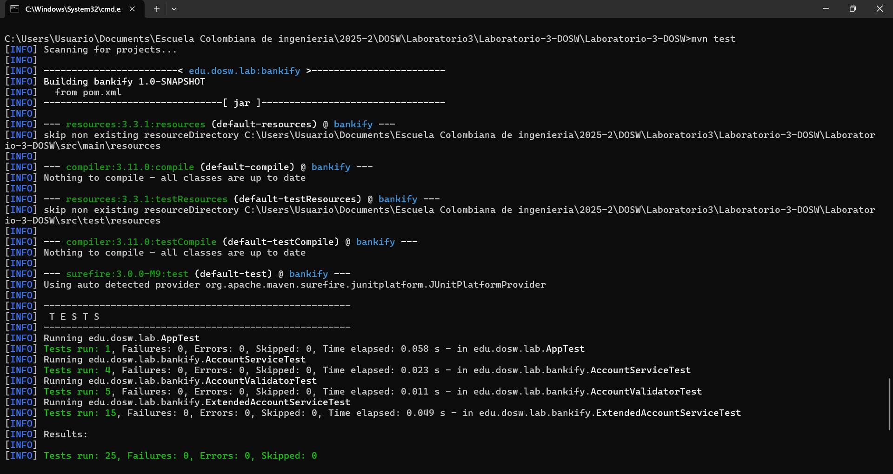

# Sistema Bancario **Bankify** — Reto #4

## Descripción del Proyecto
Sistema bancario modular que implementa la gestión de cuentas bancarias con validaciones de negocio estrictas, desarrollado aplicando metodología **TDD** y principios **SOLID**.

## Objetivo del Reto
Implementar un sistema de gestión de cuentas bancarias aplicando el ciclo **TDD (Test-Driven Development)** y principios de diseño sólidos para garantizar calidad, mantenibilidad y extensibilidad.

---

## Características Implementadas
### Reglas de Negocio Cumplidas
1. **Validación de formato:** Números de cuenta de exactamente **10 dígitos**.
2. **Validación de banco:** Los dos primeros dígitos deben corresponder a **bancos registrados**.
3. **Validación de caracteres:** Solo se permiten **números**, sin letras ni caracteres especiales.
4. **Asociación única:** Cada cuenta está asociada a **un único cliente**.
5. **Prevención de duplicados:** No se permiten **números de cuenta repetidos**.
6. **Validación de operaciones:** Solo se permiten operaciones sobre cuentas **válidas y registradas**.
7. **Consulta controlada:** Solo consulta de saldo para **cuentas existentes**.

---

## Principios y Patrones Aplicados
### 1. Principios SOLID
- **Single Responsibility Principle (SRP)**
  - `AccountValidator`: Responsable únicamente de validar números de cuenta.
  - `AccountService`: Responsable de gestionar operaciones de cuenta.
  - `ExtendedAccountService`: Añade funcionalidad sin modificar responsabilidades existentes.

- **Open/Closed Principle (OCP)**
  - Extensión mediante `ExtendedAccountService` sin modificar clases existentes.
  - Nuevas reglas de negocio agregadas mediante extensión, sin tocar el código base.

- **Liskov Substitution Principle (LSP)**
  - Las implementaciones son intercambiables respetando las interfaces.
  - Las extensiones mantienen compatibilidad con contratos existentes.

- **Interface Segregation Principle (ISP)**
  - Servicios especializados (validación, operaciones) con interfaces cohesivas.

- **Dependency Inversion Principle (DIP)**
  - Inyección de dependencias en constructores.
  - Dependencia de abstracciones (`Repository`, `Service`) en vez de implementaciones concretas.

### 2. Test-Driven Development (TDD)
Ciclo aplicado: **Rojo → Verde → Refactor**
1. **Rojo:** Primero se escribieron las pruebas que fallan.
2. **Verde:** Implementación mínima necesaria para hacer pasar las pruebas.
3. **Refactor:** Mejora del diseño y limpieza del código manteniendo el comportamiento.

### 3. Patrones de Diseño
- **Repository Pattern**
  - `AccountRepository`, `BankRepository`, `ClientRepository`.
  - Abstraen el acceso a datos y facilitan el intercambio de implementaciones.

- **Service Layer Pattern**
  - `AccountService`, `ExtendedAccountService`.
  - Separación clara entre lógica de negocio y persistencia.

- **Validator Pattern**
  - `AccountValidator` con responsabilidad única para validación de cuentas.

- **Exception Handling Pattern**
  - `BankingBusinessException` para errores de negocio específicos y manejo consistente de errores.

### 4. Java Moderno
- **Streams API**
  - Validaciones expresivas como `accountNumber.chars().allMatch(Character::isDigit)`.
  - Búsquedas y operaciones sobre colecciones usando streams: `client.getAccounts().stream().anyMatch(...)`.

- **Lambda Expressions**
  - Expresiones concisas para validaciones y transformaciones, mejorando legibilidad.

- **Optional API**
  - Uso de `Optional<Account> findByNumber(String number)` para manejo elegante de valores que pueden estar ausentes.

---

##  Suite de Pruebas
### Pruebas de Validación (`AccountValidatorTest`)
- Validación de formato de cuenta.
- Validación de existencia de banco.
- Prevención de caracteres inválidos.
- Manejo de valores nulos.

### Pruebas de Servicio Extendido (`ExtendedAccountServiceTest`)
- Creación de cuentas respetando reglas de negocio.
- Prevención de cuentas duplicadas.
- Validación de la asociación cliente–cuenta.
- Operaciones solo sobre cuentas existentes.
- Manejo de cuentas inactivas.

---

## Logros del Reto

- **TDD aplicado correctamente:** Ciclo Rojo–Verde–Refactor.
- **Pruebas unitarias completas:** Cobertura de funcionalidades críticas.
- **Streams y Lambdas:** Uso efectivo de Java moderno.
- **Javadoc completo:** Documentación exhaustiva de clases y métodos.
- **Principios SOLID:** Aplicados correctamente en la arquitectura.
- **Patrones de diseño:** Implementación de múltiples patrones para claridad y extensibilidad.
- **Código limpio:** Estándares y convenciones seguidos.

---

## Conclusiones

El sistema implementa correctamente todas las reglas de negocio requeridas mediante una arquitectura robusta y extensible. La aplicación estricta de **TDD** garantiza la calidad del código y que cada cambio esté respaldado por pruebas automatizadas. Los principios **SOLID** y los patrones de diseño aplicados aseguran mantenibilidad y facilidad para escalar funcionalidades en el futuro.

Las pruebas demuestran que el sistema valida correctamente las condiciones de negocio y previene operaciones inválidas, cumpliendo exhaustivamente con los requisitos del reto.

## Evidencias de test

