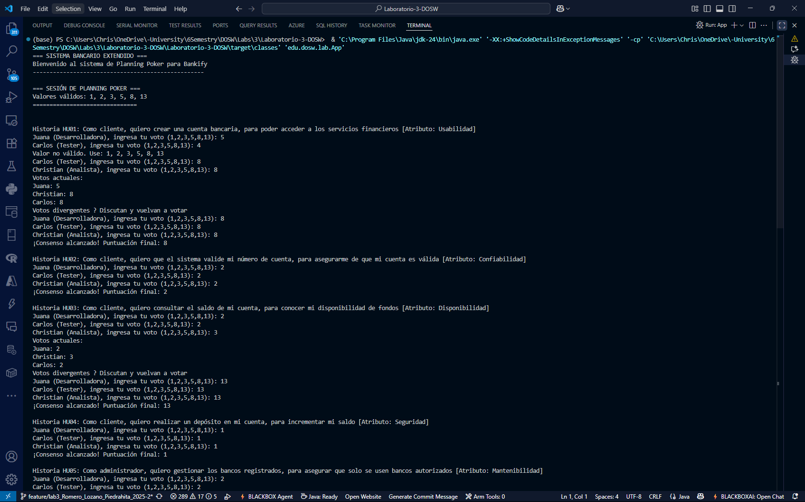
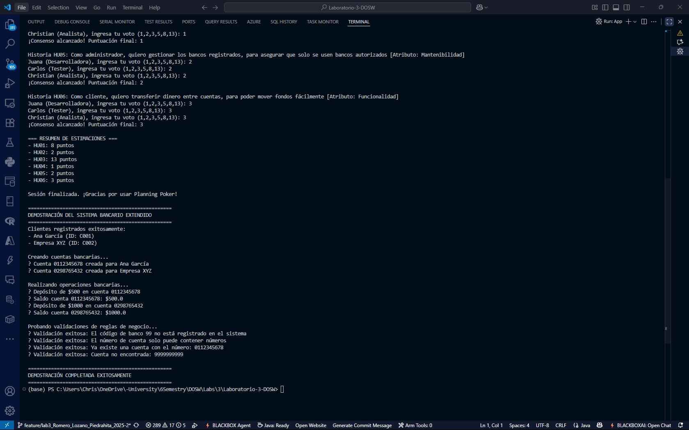
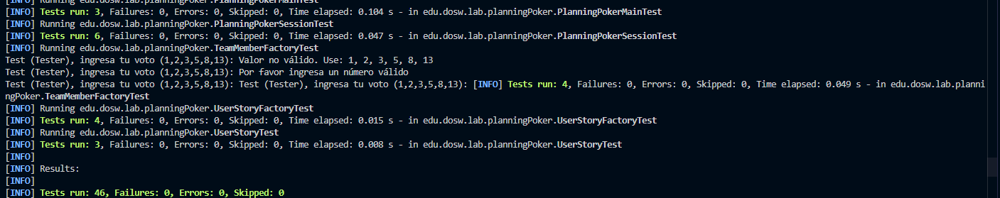

##  Patrones usados en Planning Poker

### 1️ Patrón Factory

**Clases involucradas:** `UserStoryFactory`, `TeamMemberFactory`

Este patron encapsula la lógica de creación de objetos y nos permite tener mayor extensibilidad, pues hace mas facil la creacion de un nuevo usuario, lo que es ideal si el equipo crece, por otro lado tambien tenemos el patron fabrica para los tipos de votaciones, es decir, vamos a manejar dinamicamente xada votacion o proyecto.
```java
public static UserStory createUserStory(String id, String actor, String objetivo, String beneficio, String atributoCalidad) {
    return new UserStory(id, actor, objetivo, beneficio, atributoCalidad);
}
```


- Centraliza la creación de objetos
- Facilita la extensión sin modificar el código existente
- Mejora la mantenibilidad

---

### 2️ Principio de Abierto/Cerrado (OCP)

Los patrones fabrica utilizados nos dejan cumplir con la O de los principios solidadm ya que hacen que los dinamico del proyecto se pueda adapatar partir de la extencion del codigo

```java
public static List<UserStory> createBankifyUserStories() {
    // Historias predefinidas
}

public static List<UserStory> createCustomUserStories() {
    // Historias personalizadas
}
```


---

### 3️ Patrón Composite

Las historias de usuario se gestionan como una colección permitiendo tratar tanto elementos individuales como agrupados de forma uniforme.

- Simplifica el código
- Nos permite un codigo dinamico, en especial para jerarquias
- Facilita la visualización y manipulación de grupos de historias

---

### 4️ Principio de Inversión de Dependencias (DIP)

Las clases dependen de abstracciones, no de implementaciones concretas. Por ejemplo `PlanningPokerSession` interactúa con interfaces, lo que permite desacoplar la lógica de negocio de las clases específicas


---

### 5️ Patrón Singleton (Implícito)

Las fábricas utilizan metodos estáticos, actuando como un punto único de acceso para la creación de objetos. Aunque no se implementa un singleton explicito el comportamiento es similar.


---

# Capturas
### Implementacion
<div align="center">



</div>


### Test
<div align="center">

</div>
