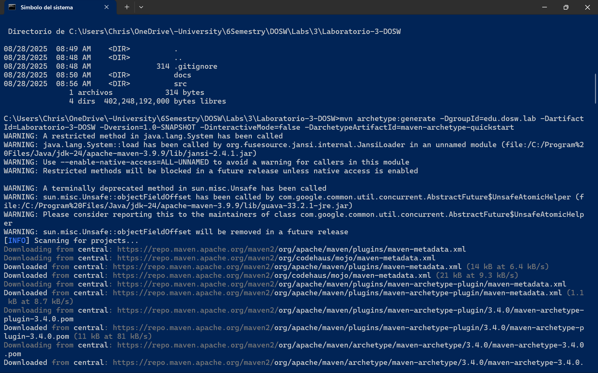
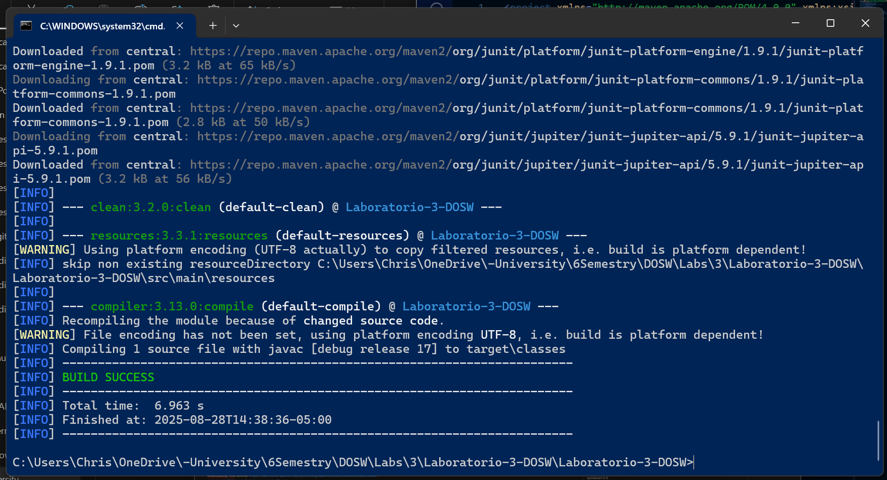
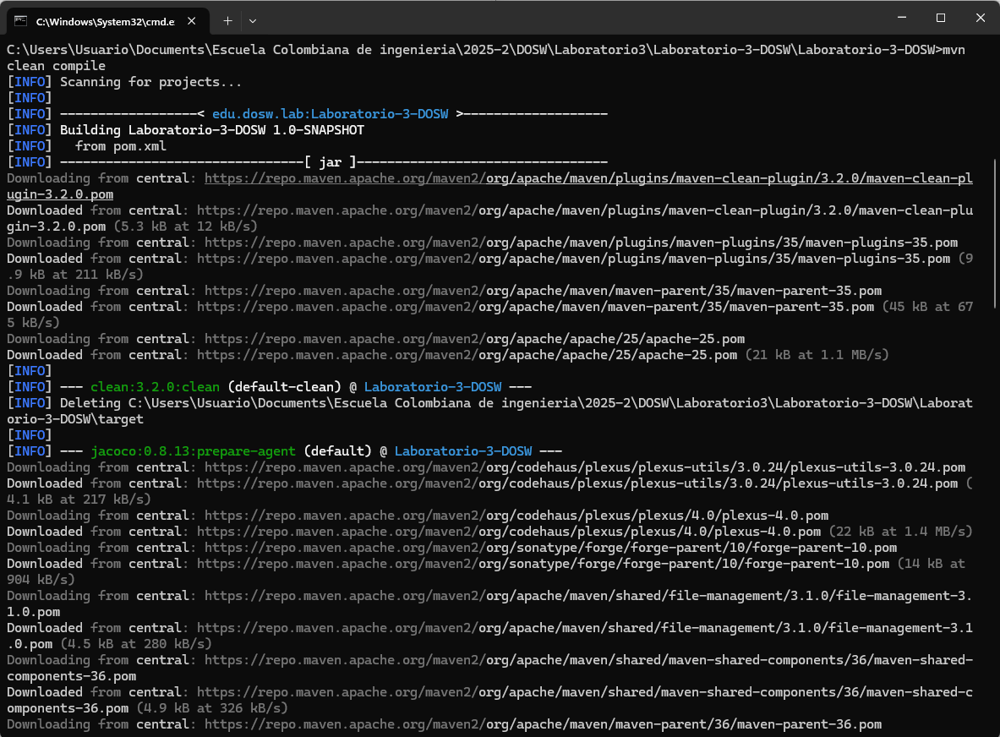
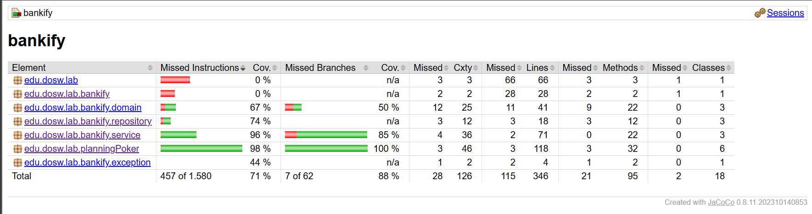
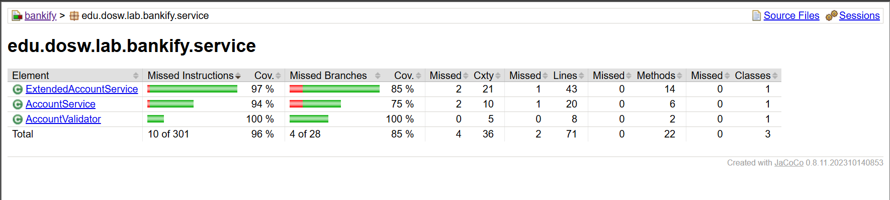
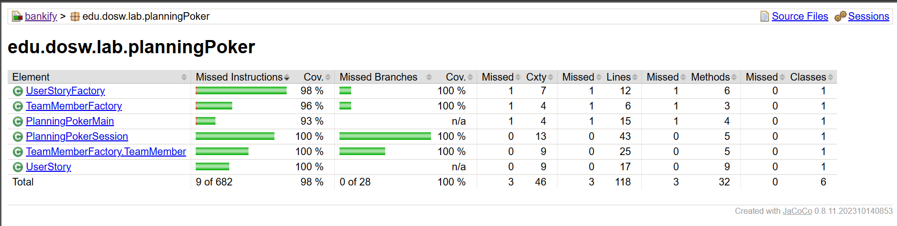

<h1 align="center">Laboratorio 3 - DOSW</h1>

## Integrantes

- Carlos Mario Piedrahita Arango
- Juana Lozano Chaves
- Christian Alfonso Romero Martinez

<h2 align="left" style="color:#2e86de; font-size:2em;">Parte 1: Compilación de Maven</h2>

---

	
	
	
	

**Evidencias trabajo integrante 2**

	
	
	

<h2 align="left" style="color:#2e86de; font-size:2em;">Parte 2: Hora del Código</h2>

**Reto 1**
**Reglas de Negocio**
1.	Los números de cuenta deben tener exactamente 10 dígitos.
2.	Una cuenta es válida únicamente si los dos primeros dígitos corresponden a un banco registrado en el sistema (ejemplo: 01 → Bancolombia, 02 → Davivienda, etc.).
3.	Los números de cuenta no pueden contener letras ni caracteres especiales, solo números.
4.	Cada cuenta debe estar asociada a un único cliente registrado en el sistema.
5.	Una cuenta no puede ser creada si ya existe otra con el mismo número.
6.	Solo se pueden realizar operaciones (consulta, depósito) sobre cuentas válidas y registradas.
7.	La consulta de saldo únicamente está permitida si la cuenta existe en el sistema.

**Funcionalidades principales**
1. Creación y validación de cuentas: Se debe poder validar que el número de cuenta cumpla con las reglas de negocio ya antes expuestas y que la cuenta tenga asociado un cliente.  
2. Consulta de saldo de una cuenta: retornar el saldo actual de una cuenta válida. 
3. Depósito en cuenta: permitir consignar dinero a una cuenta registrada y actualizar el saldo después del depósito. 
4. Gestión de bancos registrados: Permitir administrar qué códigos de banco son válidos y validar la existencia del banco mediante el uso de su código. 

**Actores Principales**
1. Cliente: persona natural o jurídica que solicita la creación de una cuenta, realiza depósitos y consulta saldos. 

2. Sistema Bankify: plataforma que valida, crea y gestiona las cuentas y operaciones financieras. 

3. Administrador del sistema (futuro): registra o actualiza los bancos válidos en el sistema. 

**Precondiciones del Sistema**

1. El sistema debe contar con una lista de bancos registrados y sus respectivos códigos de dos dígitos.  
2. El cliente debe estar registrado en la plataforma para poder abrir una cuenta.  
3. El sistema debe tener un repositorio seguro donde almacenar cuentas y saldos.  
4. El sistema debe contar con mecanismos de autenticación para que solo el cliente acceda a su información.  
5. Debe existir un entorno de pruebas con cobertura (JaCoCo) y análisis estático (SonarQube) configurado para garantizar calidad del software.

# Reto 5

### Capturas

Todas las mediciones estuvieron en el 85% de medicion, es decir cumplimos anticipadamente con este requerimiento, incluso en PLanning Poker, que tambien tuvo pruebas y tuvo una covertura superior al 95%

## Reflexion del uso de JaCoCo 
Antes de entrar en materia es importante definir que califica esta metrica 
Instrucciones: Porcentaje de bytecode ejecutado
Ramas: Cobertura de decisiones condicionales
Líneas: Porcentaje de líneas de código ejecutadas
Métodos: Porcentaje de métodos llamados
Clases: Porcentaje de clases utilizadas

Dicho lo anterior
Su importancia radica en la deteccion del codigo no provado, por lo que nos obliga como desarrolladores a hacer pruebas de verdad, es decir significativas, lo que nos lleva a hacer un codigo de mejor calidad y previene las regreciones. asi mismo es un estandar de la industria. 
Por otro lado nos encontramos en una cobertura superior al 85% por lo que ademas de la calidad garantizamos la ausencia de bugs. en caso de presentar un 60% es acpetable pero no demuestra mucho, mientras que inferior puede ser una alerta.